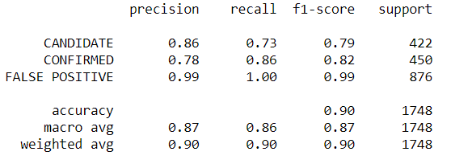
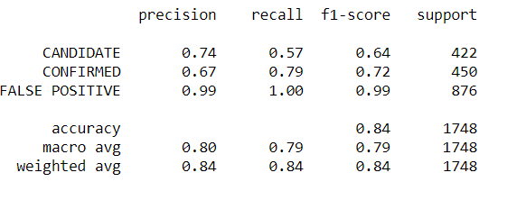
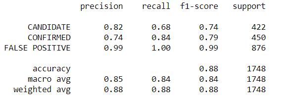

# Analysis

## Preprocessing Data

- Initially, as part of features selection, koi_fpflag fields and err1 fields was not included. However, the finding was that removing these features decreased the accuracy dramatically, hence these were finally considered for the model.

- Also, for the SVM model,training and testing scores were around 0.85, while using MinMaxScaler. Changing to StandardScaler was a better idea , that moved the score up to 0.89

## Findings

SVM model performs slightly better than KNN and Logistic Regression models , with an accuracy score of 0.90

### Model-1 SVM

### Model-2 KNN

### Model-3 Logistic Regression

